<!-- _class: cover -->

LAN FILE TRANSFER / COURSE DEMO

# PyLocalSend

一个面向局域网的文件传输工具。发送端登记路径，接收端通过 CLI 或浏览器下载；也可按需允许接收端反向上传。

Python · FastAPI · NiceGUI · Streaming

---

<!-- _class: chapter -->

01 / PROBLEM

# 文件传输的问题，常常不在“能不能传”

而在于能不能低成本、少步骤、稳定地把文件送到接收端。

---

## 传统方式的阻力

  

    01
    <h3>U 盘</h3>
    
依赖设备，反复插拔，文件夹内容容易遗漏。

  

  

    02
    <h3>网盘</h3>
    
需要公网中转，速度和隐私都不完全可控。

  

  

    03
    <h3>聊天软件</h3>
    
大文件限制多，目录结构不友好。

  

  
PyLocalSend 试图把“传文件”变简单。

---

## &#20256;&#32479;&#26041;&#26696;&#65306;&#20808;&#22797;&#21046;&#21040;&#20869;&#23384;

---

## PyLocalSend &#26041;&#26696;&#65306;&#36793;&#35835;&#36793;&#21457;

---

## 项目定位

  

    <h2>发送端负责共享，接收端负责下载。</h2>
    
不引入复杂账号系统，不依赖公网服务，不提前复制文件。

  

  

    
<b>接收端零安装</b>WebUI 打开链接即可下载。

    
<b>1 服务</b>发送端启动本地 HTTP 服务。

    
<b>N 接收</b>多个接收端通过 PIN 或 token 访问。

  

---

<!-- _class: chapter -->

02 / PRODUCT

# 两种使用方式

CLI 负责精确控制，WebUI 负责轻量接收。

---

## 发送端 WebUI

  

    <h2>只管理共享路径，不复制文件。</h2>
    
发送端只登记本地文件或文件夹路径，界面负责展示和管理。

  

  

    
<b>文件</b>注册、查看、删除共享路径；勾选控制开放范围。

    
<b>接收端</b>创建 token 链接；允许/禁止浏览器上传；禁用/启用。

    
<b>记录</b>查看下载者、时间、状态和传输量。

    
<b>设置</b>分片大小、浏览器上传存放路径；亦可改端口、PIN、加密等。

  

---

## CLI 使用

  

    <h2>适合批量和精确下载。</h2>
    
命令行可指定目标目录，支持并行下载和断点续传。

    

      sender
      upload
      ls-remote
      download
    

  

  

<pre><code>pylocalsend gui

pylocalsend upload D:\data\file.zip D:\photos

pylocalsend ls-remote `
-H http://192.168.1.100:8765 --pin 123456

pylocalsend download file.zip `  -d D:\downloads`
-H http://192.168.1.100:8765 --pin 123456</code></pre>

  

---

## 接收端 WebUI

  

    A
    <h3>单文件</h3>
    
浏览器直接请求下载接口，文件保存到接收端浏览器下载目录。

  

  

    B
    <h3>文件夹</h3>
    
发送端按开放范围生成 ZIP 流，浏览器保存为 `<文件夹名>.zip`。

  

  
仅显示发送端已勾选的项；catalog 版本轮询自动同步，无需手动刷新。

---

## 接收端浏览器上传

  

    C
    <h3>权限开关</h3>
    
发送端在「接收端管理」中按接收端单独<strong>允许上传</strong>或<strong>禁止上传</strong>；默认禁止。

  

  

    D
    <h3>上传标签页</h3>
    
被允许的接收端打开 `/r/&lt;token&gt;` 后，页面出现<strong>「上传文件」</strong>标签，使用 NiceGUI 上传组件，支持多文件自动上传。

  

  
<h3>存放路径</h3>
<code>{upload_dir}/{接收端名称}/</code>；<code>upload_dir</code> 可在设置中配置。

  
<h3>默认目录</h3>
留空时使用 <code>~/.pylocalsend/browser_uploads</code>。

  
<h3>同名处理</h3>
目标文件已存在时自动追加时间戳，避免覆盖。

---

## 下载开放与接收端控制

  

    01
    <h3>开放勾选</h3>
    
发送端首列复选框决定对接收端可见的路径；子文件夹/子文件支持级联选择，状态写入 `download_grants`。

  

  

    02
    <h3>禁用接收端</h3>
    
禁用后禁止新下载、新上传，并中断进行中的下载；解除禁用后 token 链接恢复正常。

  

  
<h3>允许上传</h3>
按接收端开启浏览器反向传文件到发送端电脑。

  
<h3>全部开放</h3>
一键开放所有已注册项。

  
<h3>自动同步</h3>
接收端每 2 秒检测 catalog-version 变化。

---

<!-- _class: chapter -->

03 / ARCHITECTURE

# 路径登记，按需读取，流式返回

从“两次上传”变成“一次上传”

---

## 整体架构

  

    <h3>发送端电脑</h3>
    
SenderService / FastAPI

    
NiceGUI 发送端管理页

    
SQLite 元数据与下载日志

    
本地真实文件 / 文件夹

  

  

    HTTP 
    STREAM 
    PIN / TOKEN 
    RANGE 
    UPLOAD*
  

  

    <h3>接收端电脑</h3>
    
CLI ReceiverClient

    
浏览器 Receiver WebUI

    
浏览器下载管理器

    
本地下载目录

  

---

## 文件共享流程

  
<b>01</b>启动发送端服务

  
<b>02</b>登记文件或文件夹路径

  
<b>03</b>保存元数据到 SQLite

  
<b>04</b>接收端获取已开放文件列表

  
<b>05</b>发起下载请求

  
<b>06</b>发送端分片读取并返回

  
<h3>不复制</h3>
注册时只保存路径和元数据。

  
<h3>不缓存</h3>
下载时直接读取源文件。

  
<h3>低内存占用</h3>
分片读写，避免一次性加载大文件。

---

## 文件夹下载策略

  

    CLI
    <h3>递归下载</h3>
    <ul>
      <li>获取目录树</li>
      <li>在接收端重建相对路径</li>
      <li>支持并行和断点续传</li>
    </ul>
  

  

    WEB
    <h3>ZIP 流</h3>
    <ul>
      <li>按需枚举文件夹</li>
      <li>边读取边写入 ZIP 响应</li>
      <li>不生成临时压缩包</li>
    </ul>
  

<pre><code>folder/                 browser download
  a.txt      -------->  folder.zip
  nested/
    b.txt</code></pre>

---

## 访问控制与记录

  
<b>PIN</b>发送端统一 PIN，CLI 与 API 鉴权。

  
<b>TOKEN</b>每接收端独立链接；可禁用/启用，临时管控下载与上传。

  
<b>GRANT</b>按路径控制可见性；列表、树、下载、ZIP 均过滤。

  
<b>UPLOAD</b>按接收端开关浏览器上传；<code>upload_dir</code> 配置存放根目录。

  
<b>LOG</b>记录下载者、时间、状态与传输字节数。

  
<b>VER</b>共享项与 grants 哈希为 catalog 版本；WebUI 轮询自动同步。

---

<!-- _class: chapter -->

04 / IMPLEMENTATION

# 代码结构保持清晰

CLI 和 GUI 只是入口，核心能力集中在 `core` 层。

---

## 技术栈

  
<b>FastAPI</b>提供 HTTP API、鉴权、文件下载流。

  
<b>NiceGUI</b>构建发送端管理页面和接收端 WebUI。

  
<b>httpx</b>接收端 CLI 请求列表和下载流。

  
<b>Rich</b>命令行多文件下载进度条。

  
<b>SQLite</b>保存共享文件、接收端和下载记录。

  
<b>cryptography</b>AES-CTR 可寻址加密流。

---

## 项目结构

  

    <h2>Core 提供业务能力。</h2>
    
不同入口复用同一套传输、配置、数据库和加密逻辑。

  

  

<pre><code>pylocalsend/
  cli/                 # 命令行入口
  core/
    file_handler/      # 元数据、目录遍历、分片读写、download_grants
    receiver/          # 接收端下载客户端
    transfer/          # 发送端服务和 API
    utils/             # 配置、数据库、加密、网络
  gui/
    sender/            # 发送端 WebUI
    receiver/          # 接收端 WebUI
tests/
doc/</code></pre>
  

---

## 数据持久化

  

<pre><code>~/.pylocalsend/
  config.json
  session.json
  pylocalsend.db</code></pre>
  

  

    
<b>files</b>路径、名称、大小、类型、状态。

    
<b>download_grants</b>每个共享项的开放相对路径。

    
<b>receivers</b>名称、PIN、token、状态、upload_allowed。

    
<b>config</b>含 upload_dir：浏览器上传存放根目录。

    
<b>logs</b>下载者、时间、状态、字节数。

  

---

<!-- _class: chapter -->

05 / DEMO

# 课堂演示

---

## 演示视频

<video src="./video/demo.mp4" controls style="display:block; width:1040px; margin:24px auto 0; border:1px solid #e7e2d8; background:#fff;"></video>

---

## 当前限制

  

    <h3>浏览器限制</h3>
    
WebUI 下载位置由浏览器控制，不能任意写入绝对路径。

  

  

    <h3>网络边界</h3>
    
当前默认面向可信局域网；直接公网访问需要额外配置和安全加固。

  

  

    <h3>上传不自动共享</h3>
    
接收端上传后需发送端手动注册路径，才会出现在共享列表并开放下载。

  

  

    <h3>接收端上传体积</h3>
    
WebUI 上传经浏览器读入内存再写入磁盘，超大文件更适合 CLI 或本机路径注册。

  

  
CLI 更适合复杂批量下载；WebUI 更适合零安装接收、反向上传和课堂演示。

---

<!-- _class: end -->

SUMMARY

# PyLocalSend

发送端只登记路径，下载时流式读取。尽量降低操作复杂度，让文件更直接地抵达接收端。

  低成本
  局域网
  流式传输
  可管理
  细粒度开放
  反向上传

---

  
<b>李子健</b>GUI 和 CLI 设计和实现，核心逻辑代码，视频剪辑

  
<b>杨秉熹</b>核心逻辑代码，视频素材提供，PPT 制作

---

<!-- _class: end -->

# Q&A

谢谢观看

